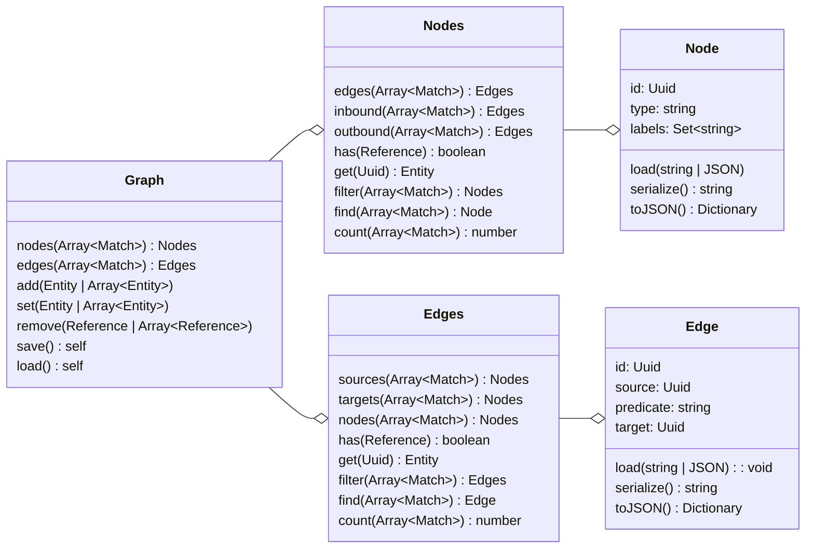

## High-level overview
This picture glosses over a few details — there are several distinct interfaces (Searchable, Persistable, etc) that mark Graph and Subgraph classes as having certain capabilities, for example. But for a given graph implementation, this is how the interfaces are generally meant to come together.

Not depicted here are the Match, Predicate, and Path classes; they're important for specific operations but don't change the big picture.

