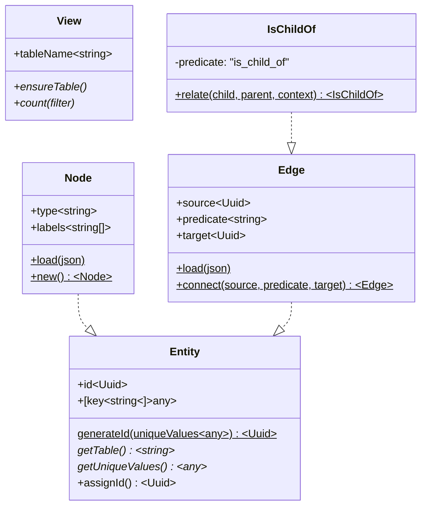

# Simple Graph Object/DB Schema

```mermaid
classDiagram
    class Entity {
        +id~Uuid~
        +[key~string~]~any~
    
        generateId(uniqueValues~any~)$~Uuid~
        getTable()*~string~
        getUniqueValues()*~any~
        +assignId()~Uuid~
    }

    class Node {
        +type~string~
        +labels~string[]~
        +load(json)$
        +new()$~Node~
    }

    class Edge {
        +source~Uuid~
        +predicate~string~
        +target~Uuid~
        +load(json)$
        +connect(source, predicate, target)$~Edge~
    }

    class View {
        +tableName~string~
        +ensureTable()*
        +count(filter)*
    }

    class IsChildOf {
        -predicate: "is_child_of"
        +relate(child, parent, context)$~IsChildOf~
    }


    Entity
    Node..|>Entity
    Edge..|>Entity
    IsChildOf..|>Edge
```